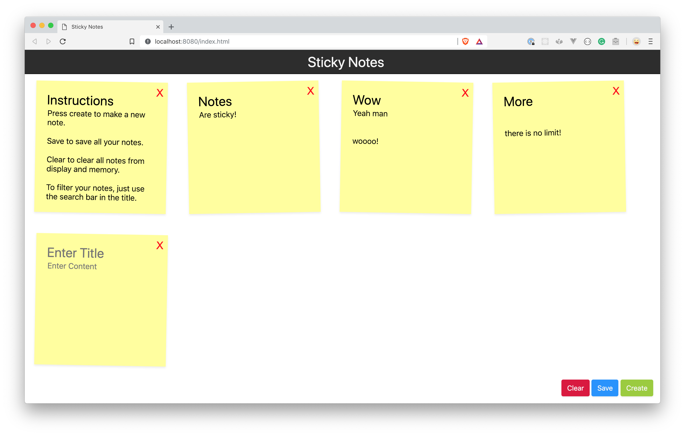

# Sticky Note



A simple single page app to store all your sticky notes.

## Features

- Create as many sticky notes as you want or need!
- Save the notes in localstorage for future reference.
- Notes are editable and can be deleted.
- Filter notes by title to get to what you need quickly.
- Reponsive design - works on mobile!
- Compatible with Chrome, Safari, IE >= 10

## Instructions

To begin initialize the app by the following yarn commands.

(replace yarn with npm if use npm)

```
yarn install
```

Start an instance of the app:

```
yarn start
```

```
yarn run v1.12.3
$ http-server
Starting up http-server, serving ./
Available on:
  http://127.0.0.1:8081
  http://10.193.240.214:8081
Hit CTRL-C to stop the server
```

Click on the links displayed to launch the app.

## Design Considerations

- ES2015 syntax and methods for IE 10 compatibility.
- Inline-block display setting for notes to facilitate a simple responsive design without too much tinkering.
- Fixed menu elements to provide consistent layout.

See assignment.md
